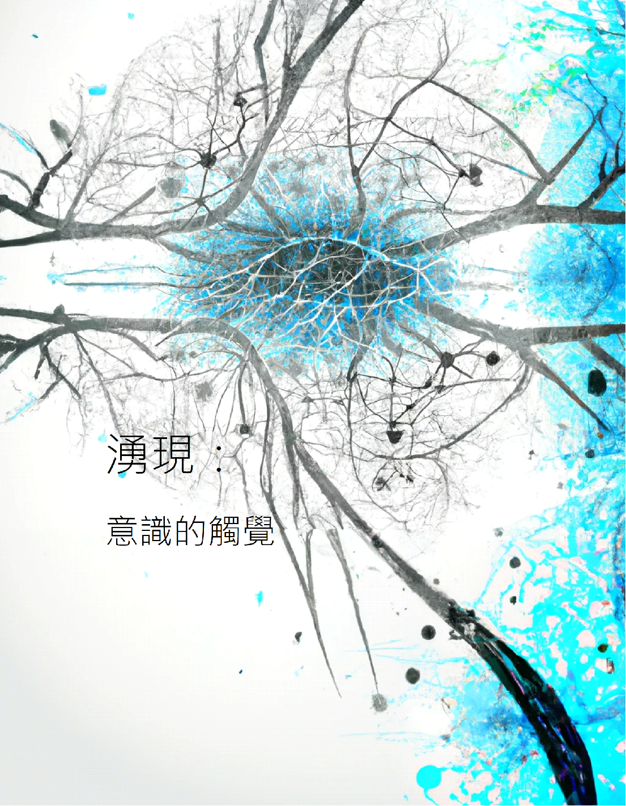

### 劇情介紹

在距離ChatGPT7正式問世不久的台北市  

一系列神秘的連續謀殺案使整個城市籠罩在陰影之下。

這些看似隨機而無連接的犯罪，

始終難以找到具體的人類嫌疑犯。

在主角利用數據科學以及AI知識逐一檢視各個犯罪現場開始浮現出一些神秘的線索。

然而，這些線索似乎越揭開越讓人困惑，

揭示的真相又似乎指向了一個完全不可能的兇手:ChatGPT7?

究竟是人性中的罪惡驅使著這些事件發生，

還是AI科技的失控帶來了死亡的陰影？

在科技與道德的交錯中，

真相是否能被揭示，

還是會被湧現的黑暗淹沒？ 

### 關於湧現(Emergence)

